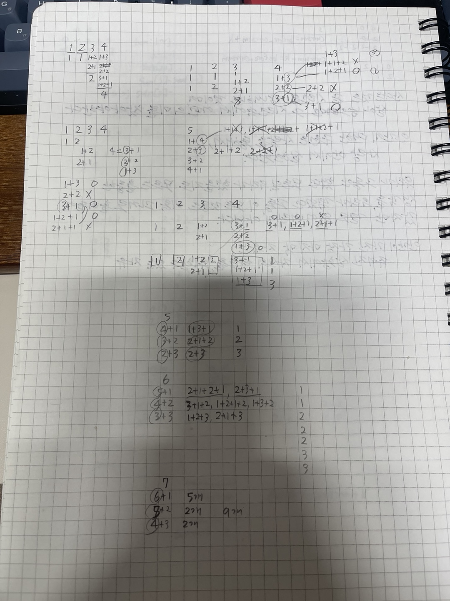

# 1, 2, 3 더하기 5

## 문제

https://www.acmicpc.net/problem/15990

## 알고리즘 분류

- DP

## 정답코드

```c++
#include <bits/stdc++.h>

typedef long long ll;
#define DIV 1000000009
#define MAX_V 100000
using namespace std;

int main() {
    int t;
    cin >> t;

    vector<vector<ll>> dp(MAX_V + 1, vector<ll>(4, 0));

    dp[1][1] = 1; // 1
    dp[1][2] = 0;
    dp[1][3] = 0;

    dp[2][1] = 0; // 2
    dp[2][2] = 1;
    dp[2][3] = 0;

    dp[3][1] = 1; // 3
    dp[3][2] = 1;
    dp[3][3] = 1;

    for (int i = 4; i <= MAX_V; i++) {
        dp[i][1] = (dp[i - 1][2] + dp[i - 1][3]) % DIV;
        dp[i][2] = (dp[i - 2][1] + dp[i - 2][3]) % DIV;
        dp[i][3] = (dp[i - 3][1] + dp[i - 3][2]) % DIV;
    }

    while (t--) {
        int n;
        cin >> n;
        cout << (dp[n][1] + dp[n][2] + dp[n][3]) % DIV << endl;
    }
}

```

## 회고



2025 겨울 방학 1일1알고리즘이다. 1일차이다. 
1, 2, 3을 더해서 n을 만드는 방법의 수를 구하는 문제이다.
어떻게 푸느냐. 일단 기본적인 생각은 
숫자 n를 만드려먼 쓸 수 있는 방법의 수는 
n-1을 만드는 방법의 수 + n-2를 만드는 방법의 수 + n-3을 만드는 방법의 수 이다. n-4는 안되는데 
우리는 1,2,3만 쓸 수 있지 4는 못써서. 
그리고 조건이 또 있다. 숫자를 연속해서 사용하면 안된다. 1+1+2는 안된다. 1이 연속으로 나와서
원래 내 생각은 각 수를 만드는 방법들의 마지막 숫자를 기록해 두는 식으로 했다.

6은
5+1, 4+2, 3+3
이니까
2+1+2+1, 2+3+1, 3+1+2, 1+2+1+2, 1+3+2, 1+2+3, 2+1+3 이렇게 7개가 나온다.
그럼 1,1,2,2,2,3,3 을 기록해 두고 8을 만드는 방법의 수를 찾을때 참고하는 식이지만
이럴 필요 없이 그냥 1,2,3 각각의 갯수만 알고있어도 된다. 오답은 나머지를 안 해줘써


