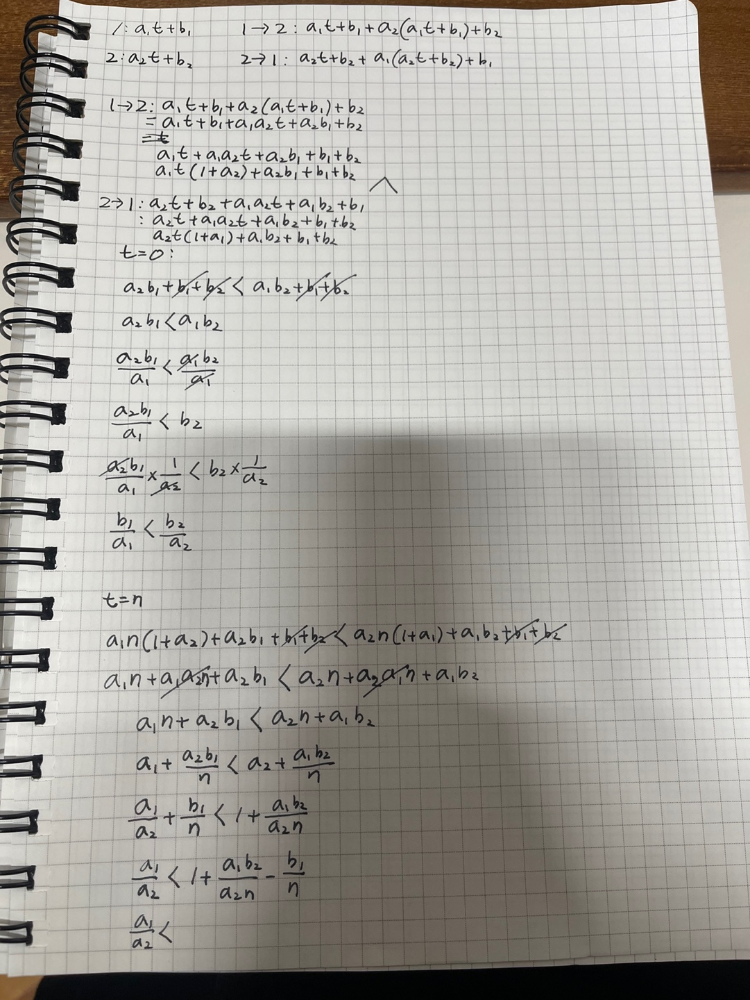

# 소방서의 고민

## 난이도

- 플레 5

## 문제

https://www.acmicpc.net/problem/2180

## 알고리즘 분류

- 그리디 알고리즘
- 정렬

## 정답코드

```c++
#include <bits/stdc++.h>

using namespace std;
typedef pair<int, int> pii;
typedef long long ll;

bool compare(const pii &a, const pii &b) {
    if (a.first == 0) return false;
    else if (b.first == 0) return true;
    else if (a.second == 0 && b.second == 0) return a.first < b.first;

    return b.first * a.second < a.first * b.second;
}

int main() {
    int n;
    cin >> n;
    vector<pii> works(n);
    for (int i = 0; i < n; i++) {
        cin >> works[i].first >> works[i].second;
    }

    sort(works.begin(), works.end(), compare);

    ll totalTime = 0;

    for (auto work: works) {
        totalTime += work.first * totalTime + work.second;
        totalTime %= 40000;
    }

    cout << totalTime;
}
```



## 회고

- 그리디 알고리즘을 사용하여 풀 수 있는 문제였다.
- 그리디가 정렬이랑 같이 사용되는 경우가 많은 것 같다.
- 정렬을 사용할 때 compare 함수를 사용하는 것이 익숙하지 않아서 조금 어려웠다.
- compare는 기본적으로 < 이다. 그래서 a가 b보다 작으면 true를 반환해야 한다.
```c++
bool compare(const pii &a, const pii &b) {
    if (a.first == 0) return false;
    else if (b.first == 0) return true;
    else if (a.second == 0 && b.second == 0) return a.first < b.first;

    return b.first * a.second < a.first * b.second;
} 
```
- 이것은 당연하다. a의 기울기가 0이면 b가 0이든 뭐든 상관없이 a가 먼저 처리되어야 한다. 그래서 false를 반환한다.
- b의 기울기가 0이면 비교되는 a의 기울기가 0이 아니니 a가 먼저 처리되어야 한다. 그래서 true를 반환한다.
- 당연히 a의 절편과 b의 절편이 0 이라면 작은 기울기를 가진것이 먼저다.


- 처음엔 단순하게 먼저 a끼리 비교하고 b끼리 비교하면 되겠다 싶었는데, 그렇게 하면 틀린다.
- `b.first * a.second < a.first * b.second` 이 수식이 중요한데 그건 이미지에 잘 유도되어있다.
- 즉 a작업과 b작업의 두개 중 무엇을 먼저하냐에 따라서 종료시간이 달라지는데, 그것을 비교하는 것이다.


- 그리고 그리드의 중요한 성질이 있는데, 모든 인접한 작업에 대해서 교환할 필요가 없게 정렬이 되었다면,
- 전체 순서가 최적해가 된다는 것이다.
- 쉽게 말하면 `인접한 두 화재를 교환해서 더 나은 해답을 얻을 수 없다면, 전체 순서도 최적이다.`

## 예시
- 화재 A: a = 2, b = 100
- 화재 B: a = 1, b = 1

- a/b가 작은 순서대로 정렬하면
    - A: 100/2 = 50
    - B: 1/1 = 1
    - A가 B보다 작으므로 A가 먼저 처리되어야 한다.

만약 A를 먼저하면 A가 끝나는 시간은 100시이고,  
B를 그 다음에 하니까 +101시  
즉 A->B 순서로 처리하면 201시가 걸린다.  

하지만 B를 먼저하면 B가 끝나는 시간은 1시이고,  
A를 그 다음에 하니까 +2*1+100 = 102시  
즉 B->A 순서로 처리하면 103시가 걸린다.


