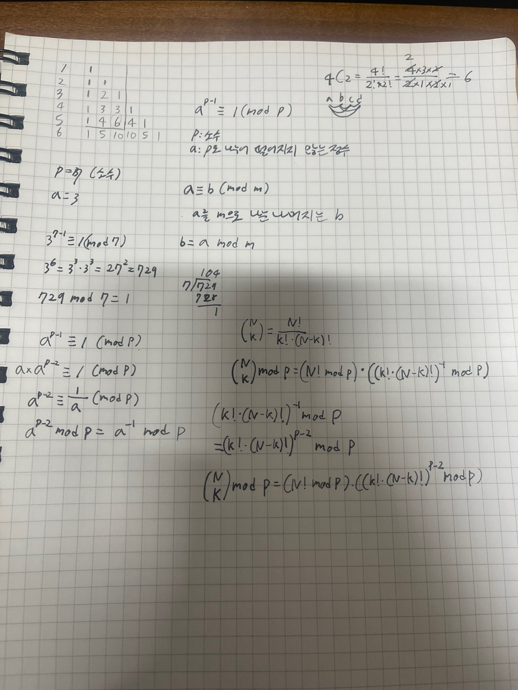

# 이항 계수 3

## 문제

https://www.acmicpc.net/problem/11401

## 알고리즘 분류

- 수학
- 정수론
- 조합론
- 분할 정복을 이용한 거듭제곱
- 모듈로 곱셈 역원
- 페르마의 소정리


## 정답코드

```c++
#include <bits/stdc++.h>

#define DIV 1000000007
typedef long long ll;
using namespace std;

ll fact(int n) {
    ll res = 1;
    for (int i = 1; i <= n; i++) {
        res = (res * i) % DIV;
    }
    return res;
}

ll fast_pow(ll a, ll b) {
    ll res = 1;
    while (b > 0) {
        if (b % 2 == 1) {
            res = (res * a) % DIV;
        }
        a = (a * a) % DIV;
        b /= 2;
    }
    return res;
}

ll binomial(int n, int k) {
    if ((k > n) || (k < 0)) return 0;

    ll res = fact(n);
    res = (res * fast_pow(fact(k), DIV - 2)) % DIV;
    res = (res * fast_pow(fact(n - k), DIV - 2)) % DIV;
    return res;
}

int main() {
    int n, k;
    cin >> n >> k;
    cout << binomial(n, k) << endl;
}
```

## 회고

- 이항 계수를 구하는 문제이다.
- 하지만 페르마의 소정리랑 거듭제곱함수가 주 어려움이었다.
- 페르마의 소정리는 `p`가 소수일 때, `a^p ≡ a (mod p)` 이다.
- 이 문제에서 페르마의 소정리가 필요한 이유는 역원을 구하기 위해서이다. 역원은 `a^-1 ≡ a^(p-2) (mod p)` 이다.
- 빠른 거듭제곱함수는 `a^b`를 구하는 함수이다. 주 원리는 `a^b = a^(b/2) * a^(b/2)` 이다. 이를 이용해서 재귀적으로 구현하면 된다.



