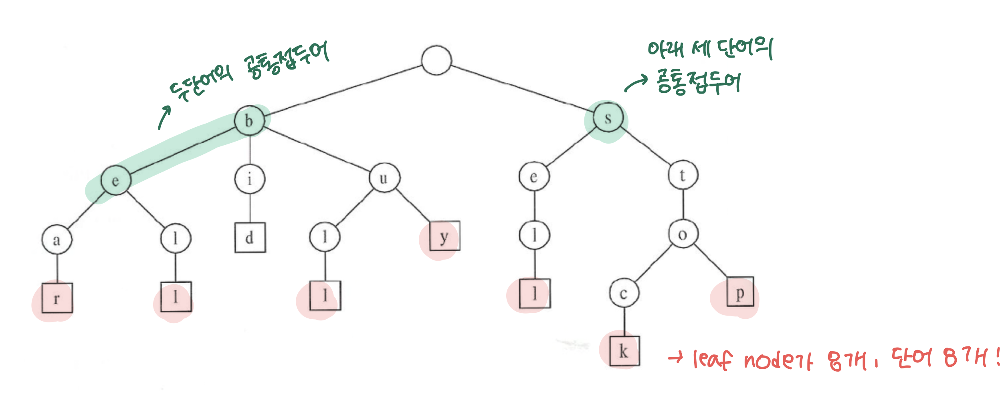

# 전화번호 목록

## 난이도

- 골드 4

## 문제

https://www.acmicpc.net/problem/5052

## 알고리즘 분류

- 자료 구조
- 문자열
- 정렬
- 트리
- 트라이

## 정답코드

```c++
#include <bits/stdc++.h>

using namespace std;

class Node {
public:
    Node *children[10]{};
    bool isEnd;

    Node() {
        for (auto &i: children) {
            i = nullptr;
        }
        isEnd = false;
    }

    ~Node() {
        for (auto &i: children) {
            delete i;
        }
    }
};

```
- 간단한 노드 구현이다. 숫자는 0~9까지만 존재하므로 10개의 자식 노드를 가진다.
- isEnd는 현재 노드가 끝인지 아닌지를 나타낸다.
- 생성자는 자식 노드를 모두 nullptr로 초기화하고, isEnd를 false로 초기화한다.
- 소멸자에서는 자식 노드를 모두 삭제한다.


```c++

class Trie {
public:
    Node *root;

    Trie() {
        root = new Node();
    }

    ~Trie() {
        delete root;
    }

    bool insert(string &s) const {
        Node *cur = root;
        for (char &c: s) {
            int digit = c - '0';
            if (cur->children[digit] == nullptr) {
                cur->children[digit] = new Node();
            }
            if (cur->isEnd) {
                return false;
            }
            cur = cur->children[digit];
        }

        for (auto & i : cur->children) {
            if (i != nullptr) {
                return false;
            }
        }

        cur->isEnd = true;
        return true;
    }
};
```

- 트라이 구현이다.
- 생성자에서는 루트 노드를 생성한다.
- 소멸자에서는 루트 노드를 삭제한다.
- insert에서는 문자열을 받아서 트라이에 삽입한다.
- 문자열을 순회하면서 각 숫자에 해당하는 자식 노드가 없으면 생성한다.
- 만약 현재 노드가 끝이면 False를 반환한다. 즉 이미 다른 번호가 이 번호의 접두어인 경우이다.
- ex ) 91이 입력되었고 911이 입력되었을 때 9->1-> 일때 1이 true일 경우
- 그리고 삽입을 완료했을때 자식 노드가 존재하면 False를 반환한다. 즉 이 번호가 다른 번호의 접두어인 경우이다.

```c++

int main() {
    ios::sync_with_stdio(false);
    cin.tie(nullptr);

    int t;
    cin >> t;
    while (t--) {
        int n;
        cin >> n;
        vector<string> v(n);
        for (string &s: v) {
            cin >> s;
        }
        Trie trie;
        bool ok = true;
        for (string &s: v) {
            if (!trie.insert(s)) {
                ok = false;
                break;
            }
        }
        cout << (ok ? "YES" : "NO") << "\n";
    }
}
```

## 회고

- 트리 구조가 생각이 나서 트라이를 사용했다. 트라이를 사용하면 시간복잡도가 O(N)이 된다.
- 트라이의 작동방식은 간단하다.

- 트리 구조를 가지는 문자열 저장방식이다.
- 이 문제에서는 동일한 접두어가 존재하면 False를 반환해야 한다.
- 예를 들어 911, 9112가 있을 때 911이 9112의 접두어이므로 False를 반환한다.
- insert중에 해당 사실을 판단하며
- insert에서 만약 현재 노드가 끝이면 False를 반환한다. 즉 이미 다른 번호가 이 번호의 접두어인 경우이다.
- insert에서 마지막 노드에 도달했을 때, 자식 노드가 존재하면 False를 반환한다. 즉 이 번호가 다른 번호의 접두어인 경우이다.
- 트라이를 처음 사용해봤는데 생각보다 쉽게 구현할 수 있었다.


